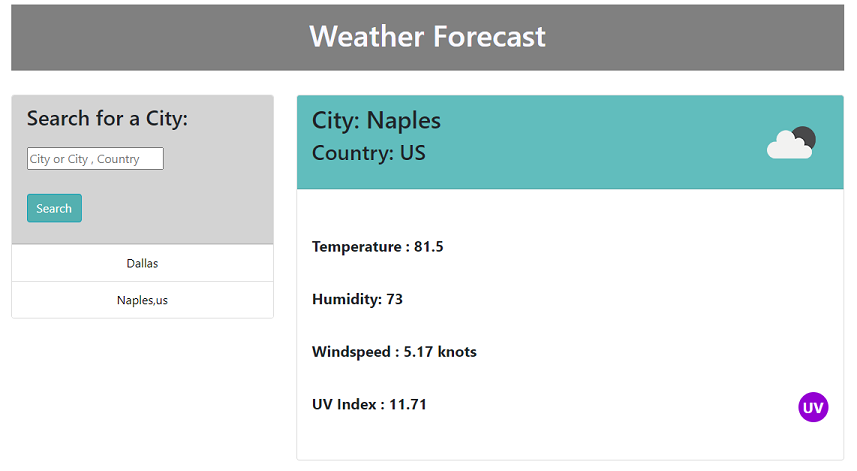
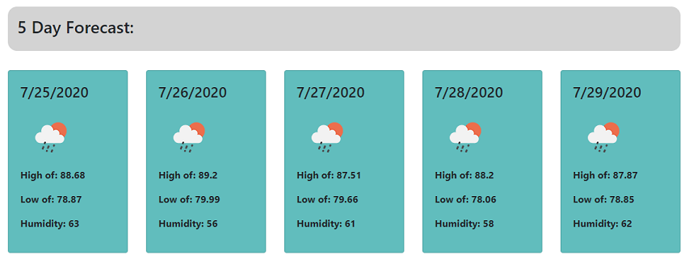

# Weather Dashboard

Weather Forcast Dashboard, that allows you to:
<ul>
    <li>Search for a city name,
    <li>Display current days weather:
    <ul>
        <li>City Name,</li>
        <li>Country Name,</li>
        <li>Date,</li>
        <li>Weather Icon,</li>
        <li>Temperature,</li>
        <li>Humidity,</li>
        <li>Windspeed,</li>
        <li>UV Index with color rating,</li>
    </ul>
    <li>Display a 5 day forecast:
    <ul>
        <li>Date,</li>
        <li>Weather Icon,</li>
        <li>Daily High Temperature,</li>
        <li>Daily Low Temperature,</li>
        <li>Humidity,</li>
    </ul>
    <li>Saves searched city to a list,</li>
    <li>Allows searched city to be clicked and display weather,</li>
    <li>Saves city list to local storage,</li>
    <li>Loads city list from local storage,</li>
    <li>Displays last searched city on refresh,</li>
    <li>Has a default display for Estero if local storage is empty.</li>
</ul>

## Functions

### getWeather

A function that has several api calls to gather the information needed for: current weather, the uv index, and the five day forecast. The uv index and five day forecast api calls are nested in the original api call as they use the latitude and longitude given from the first api call.

#### $.ajax - queryURL

This call gathers the data for the current weather. Within this function, lines 115 - 145 contain the code for the returned data for the city name, country, date, temperature, humidity, and wind speed.

#### $.ajax - uvUrl

This call uses the latitude and longitude from the first api call to get the uv index for that city. Lines 43 - 65 contain the code for setting the uv index, and also a conditional to set the color of uv index.

### $.ajax - dailyUrl

The last api call also uses the latitude and longitude to get the data for the five day forecast. Lines 86 - 107 contain the code for the data returned from this api call. A for loop is used to iterate through the data and display it. It also starts at an index of 1 instead of 0, as 0 is the current day listed.

### cityList

This function generates a list of the searched cities, and also sets them to local storage, by pushing the searched city to an array of cities searched. Once the list reaches six, it will splice out the oldest city searched and add the new one in. A for loop is used to iterate through the array and display the cities, prepending them so the latest searched is at the top of the list and the oldest at the bottom.

### getCity

This function calls the list from the local storage, displays the data, and also pushes it back into the array so that upon the page refreshing the list will remain. It will also display the last city searched.

## Event Listeners

### $("#city-btn").on("click", function ()

This event listener gathers the city searched, creates a variable for it, and pushes it throuhg the getWeather function. It also has a conditional to prevent a blank submission.

### $(".list-group-item").on("click", function ()

This event listener is created when a city is searched and added to the list. It allows the used to click on one of the recently searched cities and display them again.

## Resources

<ul>
    <li>[Bootstrap](https://getbootstrap.com/)</li>
    <li>[Jquery](https://code.jquery.com/)</li>
    <li>[OpenWeather](https://openweathermap.org/api)</li>
</ul>